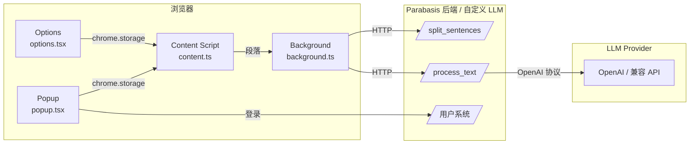
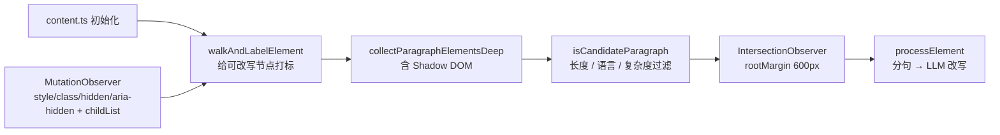

<div align="center">


# Genshred Impact

**让任何网页都成为你的分级阅读材料**

基于 LLM 的浏览器扩展，按你的语言水平实时改写网页文本，沉浸式学习外语。


<p>
  
  
  
  
  
  
  
</p>

<p>
  <a href="#-功能特性">功能</a> ·
  <a href="#-快速开始">快速开始</a> ·
  <a href="#-架构设计">架构</a> ·
  <a href="#-配置说明">配置</a> ·
  <a href="#-开发指南">开发</a> ·
  <a href="#-路线图">路线图</a> ·
  <a href="#-贡献">贡献</a>
</p>

**简体中文** · [English](./README.en.md) *(coming soon)*

</div>

---

## 项目简介

Genshred Impact 是一款 AI 驱动的浏览器扩展，它会自动识别你正在阅读的网页语言，并将句子按照你设定的难度等级（Easy / Normal / Hard / 自定义）改写为更易理解的版本。原文与改写后的文本可在悬停时切换，既不打断阅读节奏，又能在恰好需要时提供"脚手架"。

> [!TIP]
> 把任何一篇英文论文、博客或新闻变成属于你的 **i+1** 输入。读得舒服，词汇与句法就会自然内化。

## 功能特性

| 功能 | 说明 |
| :--- | :--- |
| 智能段落改写 | 自动检测语言，按句粒度调用 LLM 改写，悬停查看原文 |
| 三档难度 + 自定义 | 内置 **A2 / B2 / C1** 三档 CEFR 等级，可保存任意数量的自定义 Prompt |
| 多语言支持 | 支持 English / 中文 / 日本語 / Español / Français / Deutsch / Русский |
| 改写比例调节 | 0–100% 滑块控制每段被改写的句子比例，保留挑战感 |
| 手动选取模式 | 仅改写你框选的段落，避免污染长网页 |
| 浮动 AI 对话窗口 | 内嵌右下角浮窗，针对当前页面提问 |
| 深色模式 | 暗色 UI 与暗色改写气泡，护眼夜读 |
| 自定义 LLM 后端 | 兼容任意 OpenAI 风格 API，可填入自己的 `base_url` + `api_key` |
| 用户系统 | 可选登录，跨设备同步 Prompt 与偏好 |
| 懒加载与缓存 | 仅处理视口内段落，配合本地缓存降低成本 |
| Shadow DOM 隔离 | UI 不污染宿主页面样式，兼容 SPA 与复杂前端 |
| Walk-and-Label DOM | 借鉴 [read-frog](https://github.com/mengxi-ream/read-frog) 的段落识别策略，支持站点自定义规则、主内容区识别与 Shadow DOM 内的段落发现 |

## 截图预览

<!-- > 在仓库根目录创建 `docs/screenshots/` 目录，放入下列图片即可在 GitHub 中正常渲染。 -->

<div align="center">

| Popup 面板 | 改写效果 | 自定义 Prompt |
| :---: | :---: | :---: |
|  |  |  |

</div>

## 技术栈

<p>
  
  
  
  
  
  
  
</p>

后端服务 [`Parabasis`](../Parabasis) 使用 Flask + PostgreSQL + Docker 部署，负责分句、改写代理与用户系统。前端通过 `SERVER_URL` 与之通信，也可切换为完全自定义的 LLM 端点。

## 架构设计



<details>
<summary><strong>核心目录</strong>（点击展开）</summary>

```text
Genshred/
├── assets/                  扩展图标
├── src/
│   ├── popup.tsx            扩展弹窗 UI
│   ├── options.tsx          完整设置页
│   ├── content.ts           注入页面的主控脚本（已模块化）
│   ├── background.ts        Service Worker，转发到后端
│   ├── config.ts            SERVER_URL 等运行时配置
│   ├── constants.ts         STORAGE_KEYS / 默认设置
│   ├── types.ts             公共类型
│   ├── UserModal.tsx        登录 / 注册弹窗
│   ├── PromptSettingsModal.tsx
│   └── lib/
│       ├── api-helpers.ts          调后端 + Prompt 组装
│       ├── backend-endpoints.ts    官方 / 自定义后端解析
│       ├── dom-rules.ts            DOM 标记常量、标签规则与按站点自定义选择器
│       ├── dom-utilities.ts        Walk-and-Label 段落识别 + 跨上下文节点判断 + 文本替换
│       ├── observers.ts            MutationObserver + IntersectionObserver（懒加载 / 折叠面板感知）
│       ├── ui-components.ts        悬浮 tooltip / loading
│       ├── state-management.ts     设置状态广播
│       ├── utilities.ts            debounce / 难度评分 / 哈希等
│       └── logger.ts
├── scripts/                 发布脚本
├── .github/workflows/       CI（Plasmo BPP）
├── package.json
└── README.md
```

</details>

## 快速开始

### 方式 A：从应用商店安装（目前是否上线待定）

| Chrome Web Store | Edge Add-ons |
| :---: | :---: |
| *上线中* | *上线中* |


### 方式 B：下载 [release](https://github.com/tonyWu0322/Genshred/releases)


### 方式 C：从源码加载（开发者）

```bash
git clone https://github.com/tonyWu0322/genshred.git
cd genshred
pnpm install            # 或 npm install
pnpm dev                # 启动 Plasmo 开发服务器
```

然后在浏览器扩展页面打开「开发者模式」，加载 `build/chrome-mv3-dev/` 目录即可。修改源码会热重载。

> [!NOTE]
> 默认服务器地址定义在 `src/config.ts` 的 `SERVER_URL`，目前为项目官网，项目后端计划在未来开源：
> ```bash
> PLASMO_PUBLIC_SERVER_URL=http://localhost:5000 
pnpm dev
> ```

## DOM 解析与站点适配

> 自 v1.x 起，前端段落识别从硬编码 `querySelectorAll('p, div, span, ...')` 升级为 **Walk-and-Label** 流程，灵感来自 [read-frog](https://github.com/mengxi-ream/read-frog) 的多站点适配方案，详细分析见 [`DOM_PARSING_REPORT.md`](./DOM_PARSING_REPORT.md)。

### 核心流程



1. **Walk-and-Label**：进入页面后对 `document.body` 做一次深度遍历，按标签 / CSS / 站点规则给节点打 `data-genshred-walked`、`data-genshred-paragraph`、`data-genshred-block-node`、`data-genshred-inline-node` 等属性。
2. **Shadow DOM 友好**：遍历会递归进入 `element.shadowRoot.children`，并对每个开放的 shadow root 单独绑定 MutationObserver，覆盖 React/Vue Web Components 与组件库（Radix、Headless UI 等）。
3. **跨上下文节点判断**：使用 `nodeType === Node.ELEMENT_NODE` 而非 `instanceof HTMLElement`，避免 iframe / 不同 realm 下判断失败。
4. **懒加载触发**：通过 `IntersectionObserver(rootMargin: 600px)` 让段落临近视口时再调用 LLM，节省 token 与延迟。
5. **动态页面感知**：`MutationObserver` 同时监听 `childList`、`subtree` 与 `style / class / hidden / aria-hidden` 属性变化；折叠面板从隐藏切到显示时会被自动重新发现。
6. **AI 改写不变**：识别到的段落仍由 `processElement` 走原有的「分句 → 难度选择 → 改写 → tooltip 切换」流水线，悬停查看原文等核心 UX 完全保留。

### 标签与节点规则（节选自 `src/lib/dom-rules.ts`）

| 集合 | 含义 |
| :--- | :--- |
| `FORCE_BLOCK_TAGS` | 强制视为块级（H1–H6、UL/OL/LI、ARTICLE、SECTION、HEADER、FOOTER、MAIN、NAV…） |
| `DONT_WALK_AND_TRANSLATE_TAGS` | 完全跳过的标签（SCRIPT、STYLE、NOSCRIPT、IMG、VIDEO、CANVAS、IFRAME、svg、MathML…） |
| `DONT_WALK_BUT_TRANSLATE_TAGS` | 不递归但保留为父段落文本（CODE、TIME、KBD…） |
| `MAIN_CONTENT_IGNORE_TAGS` | 当页面存在 `<article>`/`<main>`/`[role="main"]` 时，跳过页面外的 HEADER/FOOTER/NAV/ASIDE/NOSCRIPT |
| `VISUALLY_HIDDEN_CLASSES` | 跳过 `sr-only`、`visually-hidden` 等无障碍隐藏文本 |

### 站点自定义规则

部分站点的 DOM 结构会让通用启发式失效，此时可在 `dom-rules.ts` 内添加 hostname → 选择器映射：

```ts
export const CUSTOM_DONT_WALK_INTO_ELEMENT_SELECTOR_MAP: Record<string, string[]> = {
  'chatgpt.com':   ['.ProseMirror'],
  'arxiv.org':     ['.ltx_listing'],
  'www.youtube.com': ['#masthead-container *', '#guide-inner-content *'],
  'github.com':    ['header *', '#repository-container-header *', 'table.diff-table'],
  'discord.com':   ['[id^="message-username"]', 'span[class*="-timestamp"]'],
  'deepwiki.com':  ['header *', 'nav *', 'aside *'],
  'twitter.com':   ['nav[aria-label] *', '[data-testid="sidebarColumn"] *'],
  'x.com':         ['nav[aria-label] *', '[data-testid="sidebarColumn"] *'],
  // ...在此追加新站点
}

export const CUSTOM_FORCE_BLOCK_TRANSLATION_SELECTOR_MAP: Record<string, string[]> = {
  'github.com':       ['task-lists'],
  'www.reddit.com':   ['shreddit-post-text-body'],
  // ...
}
```

`getHostnameRules()` 会在精确匹配失败时回退到 *registrable domain*（`news.example.com → example.com`），方便覆盖二级域名变体。

### 与 Read Frog 的对照

| 维度 | Genshred | Read Frog |
| :--- | :--- | :--- |
| 目标 | 按 CEFR 难度 **AI 改写** 当前语言的句子 | 把整页 **翻译** 成另一种语言 |
| 段落识别 | Walk-and-Label（移植自 read-frog） | Walk-and-Label |
| 触发方式 | IntersectionObserver + MutationObserver | IntersectionObserver + MutationObserver |
| 注入方式 | 句级 `<span class="genshred-rewrite-container">`，悬停切换原文/改写 | 段级 wrapper，原译文并列或仅显示译文 |
| 站点定制 | `CUSTOM_*_SELECTOR_MAP` per-hostname | `CUSTOM_*_SELECTOR_MAP` per-hostname |
| 安全性 | 改写文本通过 `textContent` 注入，不解析 HTML | 双语模式 textContent / 仅译文模式 innerHTML |

### 已知不足与 TODO

- 跨域 iframe 仍受同源策略限制，需要在 manifest 内加入 `all_frames: true` 并在 iframe 中重新走完整流程。
- 极长页面（10w+ 节点）的首次 walk 可能阻塞主线程；后续考虑切到 `requestIdleCallback` 分片。
- 仅译文模式（与 read-frog 对齐）暂未实装，目前所有改写都是「原句保留 + 悬停查看」。

## 配置说明

所有运行时配置均存放在 `chrome.storage.local`，Popup / Options / Content Script 共享并实时同步。

<details>
<summary><strong>常用 Storage Key</strong>（节选自 <code>src/constants.ts</code>）</summary>

| Key | 默认值 | 含义 |
| :--- | :--- | :--- |
| `genShredPluginState` | `true` | 全局开关 |
| `genShredSentenceCount` | `50` | 改写句子占比（%） |
| `genShredDifficultyLevel` | `Normal` | 当前难度 |
| `genShredDifficultyMapping` | A2/B2/C1 三档 | 难度 → Prompt 映射 |
| `genShredDarkMode` | `auto` | 改写块主题：`light` / `dark` / `auto`（按页面背景色判定） |
| `genShredManualSelect` | `true` | 仅改写框选段落 |
| `genShredMinParagraphLength` | `20` | 段落最短字符数 |
| `genShredBackendMode` | `official` | `official` / `custom` |
| `genShredCustomLlmUrl` | `""` | 自定义 LLM 端点 |
| `genShredCustomLlmApiKey` | `""` | 自定义 API Key |
| `genShredCustomLlmModel` | `gpt-4o-mini` | 模型名 |
| `genShredCustomLlmTemperature` | `0.7` | 采样温度 |

</details>

### 接入自定义 LLM

在 Options 页面切换 **Backend Mode → Custom**，填入：

```text
Split URL      :  https://your-parabasis.example.com/split_sentences
LLM URL        :  https://api.openai.com/v1/chat/completions
API Key        :  sk-********
Model          :  gpt-4o-mini
Temperature    :  0.7
Max Tokens     :  512
Timeout (ms)   :  20000
```

> [!IMPORTANT]
> 自定义 LLM 必须兼容 OpenAI Chat Completions 协议。Bearer Token 会自动注入到 `Authorization` 头中（见 `src/lib/backend-endpoints.ts`）。

## 开发指南

```bash
pnpm dev          # 开发模式（自动重载）
pnpm build        # 生产构建 → build/chrome-mv3-prod/
pnpm package      # 打包成 build/chrome-mv3-prod.zip
```

更多框架信息请见 [Plasmo 官方文档](https://docs.plasmo.com/)。


## 路线图

### 前端
- [x] `content.ts` 模块化拆分至 `src/lib/`
- [x] 自定义 LLM 后端支持
- [x] 暗色模式
- [x] 多语言检测（franc-min）
- [x] 端口/域名运行时切换
- [ ] 完整用户注册页 UI
- [x] DOM 优化（兼容 Immersive Translation / deepwiki 等场景）— 见「DOM 解析与站点适配」
- [ ] 优化体验（darkmode auto, 特定网页禁用扩展）
- [ ] 长网页懒加载策略优化（首次 walk 切到 `requestIdleCallback` 分片）
- [ ] 跨域 iframe（`all_frames: true` + iframe 内独立流水线）

### 后端（Parabasis）
- [x] 迁移至 PostgreSQL
- [ ] 数据库结构优化 & 数据脱敏
- [ ] 请求 debouncing & 错误处理
- [ ] 访问频次限流、每日次数上限
- [ ] 更完善的用户系统

> 欢迎认领上方任意 unchecked 项目，提 Issue 或直接 PR！

## 贡献

本人小白，非常欢迎 PR 与 Issue！请遵循以下流程：

1. Fork 本仓库并创建特性分支：`git checkout -b feat/awesome-thing`
2. 提交更改：`git commit -m "feat: add awesome thing"`（推荐 [Conventional Commits](https://www.conventionalcommits.org/)）
3. 推送到你的 Fork：`git push origin feat/awesome-thing`
4. 在 GitHub 上发起 Pull Request

提交 Bug / 功能请求：[New Issue](https://github.com/tonyWu0322/genshred/issues/new/choose)

## 许可证

本项目基于 **MIT License** 开源，详见 [`LICENSE`](./LICENSE) 文件。

## 作者

<table>
<tr>
  <td align="center">创意+后端：<a href="https://github.com/tonyWu0322"><sub><b>yuanyou</b></sub></a></td>
  <td align="center">原型+前端：<a href="https://github.com/yanyuss-01"><sub><b>yanyuss</b></sub></a></td>
</tr>
</table>

感谢所有 [Contributors](https://github.com/tonyWu0322/genshred/graphs/contributors)：

<a href="https://github.com/tonyWu0322/genshred/graphs/contributors">
  
</a>

## 致谢

- [Plasmo Framework](https://www.plasmo.com/) — 极佳的浏览器扩展开发体验
- [franc](https://github.com/wooorm/franc) — 轻量级语言检测
- [read-frog](https://github.com/mengxi-ream/read-frog) — Walk-and-Label 段落识别策略与多站点适配规则的参考实现（MIT License）
- 所有为分级阅读 / CEFR 标准做出贡献的语言学研究者

## Star History

<a href="https://star-history.com/#tonyWu0322/genshred&Date">
  <picture>
    <source media="(prefers-color-scheme: dark)" srcset="https://api.star-history.com/svg?repos=tonyWu0322/genshred&type=Date&theme=dark" />
    <source media="(prefers-color-scheme: light)" srcset="https://api.star-history.com/svg?repos=tonyWu0322/genshred&type=Date" />
    
  </picture>
</a>

---

<div align="center">
  <sub>Built with curiosity by language learners, for language learners.</sub><br/>
  <sub>如果这个项目帮到了你，欢迎点一颗 ⭐ Star 支持我们！</sub>
</div>
